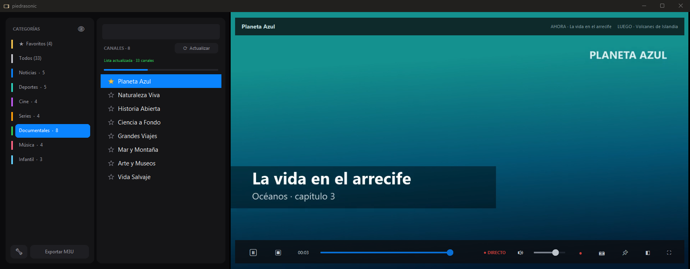
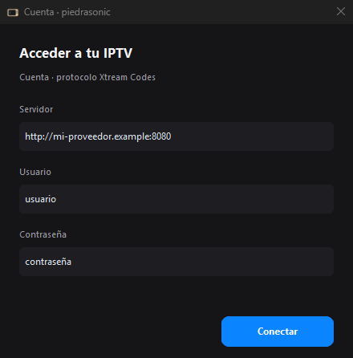
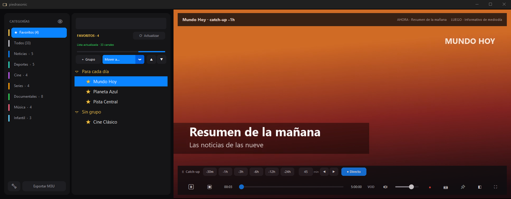

<p align="center">
  
</p>

<p align="center">
  
  
  
</p>

Reproductor de IPTV para Windows. Pones los datos de tu proveedor y ves sus
canales: lista a la izquierda, vídeo a la derecha, un clic y se ve. Lleva VLC
dentro, así que no hay que instalar nada.

Funciona con cualquier servicio compatible con **Xtream Codes**, que es el
formato que usan casi todos. piedrasonic no trae canales: reproduce los de la
suscripción que tengas.



## Instalar

1. Baja `piedrasonic-windows-x64.zip` de
   **[Releases](https://github.com/jaimealekos/piedrasonic/releases/latest)**.
2. Descomprímelo entero donde quieras.
3. Abre `piedrasonic.exe`.

La primera vez Windows avisa de que el programa no está firmado: pulsa
*Más información* → *Ejecutar de todas formas*.

No saques `piedrasonic.exe` de su carpeta, que necesita lo que tiene al lado.
Para tenerlo a mano, crea un acceso directo. Windows 10 u 11 de 64 bits.

## Uso

Al abrirlo por primera vez te pide el **servidor**, el **usuario** y la
**contraseña** que te ha dado tu proveedor.



- Elige una categoría a la izquierda y **haz clic en un canal** para verlo.
- **★** lo guarda en *Favoritos*, donde puedes agruparlos y ordenarlos.
- **Catch-up**: en los canales que lo permiten puedes volver atrás en la
  emisión, desde media hora hasta un día. *Directo* te devuelve al momento
  actual.
- **●** graba el canal; **🔧** (abajo) cambia de cuenta; **Exportar M3U** guarda
  la lista para usarla en otros reproductores.



| Tecla | Qué hace |
|-------|----------|
| `F11` o doble clic en el vídeo | Pantalla completa (`Esc` para salir) |
| `L` | Solo el vídeo (oculta las listas) |
| `M` | Silencio |
| `A` | Ventana siempre encima |
| `S` | Foto del fotograma al Escritorio |
| `F5` | Vuelve a pedir la lista de canales |

La cuenta, los favoritos y las grabaciones se guardan en la carpeta del
programa. Si ahí no se puede escribir (por ejemplo, en *Archivos de programa*),
van a `%LOCALAPPDATA%\piedrasonic`.

¿Algo no va? Cuéntalo en [Issues](https://github.com/jaimealekos/piedrasonic/issues).

## Para programadores

Hace falta Python 3.12 y un VLC de 64 bits: baja el zip de
[get.videolan.org](https://get.videolan.org/vlc/3.0.23/win64/) y descomprímelo
en `vendor\vlc`, de modo que quede `vendor\vlc\libvlc.dll`.

```bash
pip install -r requirements.txt
pythonw iptv_player.pyw
```

Para compilar el `.exe`:

```bash
pip install pyinstaller==6.22.2
pyinstaller piedrasonic.spec
```

Sale la carpeta `dist\piedrasonic`, que es lo que va en el zip. Cómo está hecho
por dentro: [docs/ARQUITECTURA.md](docs/ARQUITECTURA.md). Las pruebas:
[pruebas/LEEME.md](pruebas/LEEME.md). Las capturas de este README salen de
`python make_capturas.py`, con canales inventados.

## Licencia

[MIT](LICENSE). El programa lleva dentro [VLC](https://www.videolan.org/vlc/),
de VideoLAN, con licencia LGPL 2.1+ / GPL 2+; su texto viaja en el paquete, en
`_internal\vlc\COPYING.txt`.
