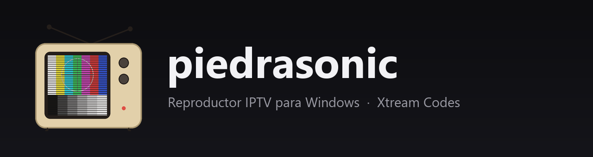
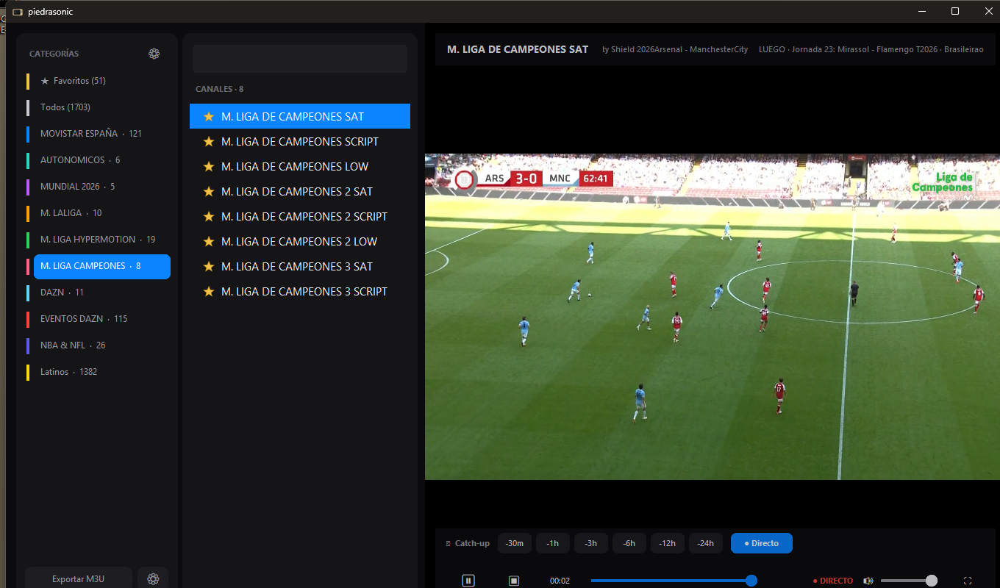
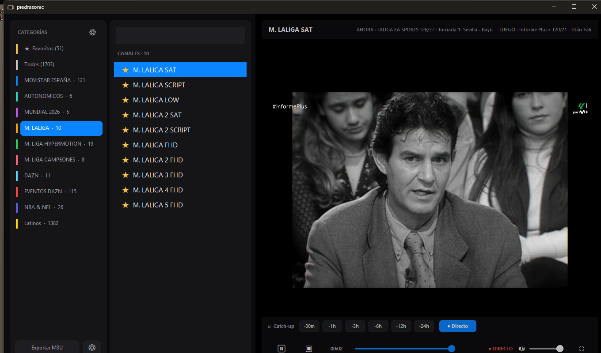

<p align="center">
  
</p>

<p align="center">
  
  
  
  
</p>

Reproductor de IPTV ligero para Windows. Protocolo **Xtream Codes**, vídeo con
VLC embebido, EPG, favoritos con grupos y catch-up.




## Descargar

Baja el `.exe` desde **[Releases](https://github.com/jaimealekos/piedrasonic/releases/latest)**
y ejecútalo. No necesita Python. Requiere **[VLC 64-bit](https://www.videolan.org/vlc/)**
instalado.

## Uso

En el primer arranque introduces **servidor, usuario y contraseña**. Se validan
contra el panel y se guardan cifradas con DPAPI de Windows (`config.json`, que no
se comparte).

- **Un clic** en un canal lo reproduce.
- **★ estrella** = favorito. En *Favoritos* se agrupan y ordenan (clic derecho o
  desplegable *Mover a*; multiselección con Ctrl/Shift).
- **Doble clic** en el vídeo o `F11` = pantalla completa.
- **`L`** (o **◧** en la barra de controles) = ocultar las dos columnas de
  la izquierda y dejar solo el vídeo; la ventana se encoge sola para que la
  imagen no cambie de tamaño ni de sitio. Otra vez y vuelven.
- **`M`** (o **🔊**) = silenciar / recuperar. El volumen y el silencio se
  recuerdan entre sesiones.
- **`A`** (o **📌**) = ventana siempre encima.
- **`S`** (o **📷**) = captura del fotograma (al *Escritorio*).
- **Catch-up** (`-30m … -24h`) en los canales que lo soportan; con la caja
  `min` saltas los minutos que quieras (`◀` atrás, `▶` adelante; llegar a 0
  vuelve al directo).
- **⚙ Cuenta** (abajo) para cambiar de servidor/credenciales.
- **⚙** (arriba) para mostrar/ocultar categorías.
- **Exportar M3U** para VLC/Kodi/TiviMate.

## Desde el código

```bash
pip install -r requirements.txt
pythonw iptv_player.pyw      # o doble clic en run.bat
```

Requiere Python 3.12 y VLC 64-bit.

## Compilar el .exe

```bash
pip install pyinstaller
pyinstaller piedrasonic.spec     # -> dist/piedrasonic.exe
```

## Estructura

| Archivo | Función |
|---------|---------|
| `iptv_player.pyw` | Aplicación |
| `xtream.py` | Cliente del protocolo Xtream |
| `player.py` | Reproductor VLC embebido |
| `settings.py` | Cuenta + cifrado (DPAPI) |
| `theme.py` | Tema visual |
| `piedrasonic.spec` | Build de PyInstaller |

## Licencia

MIT.
